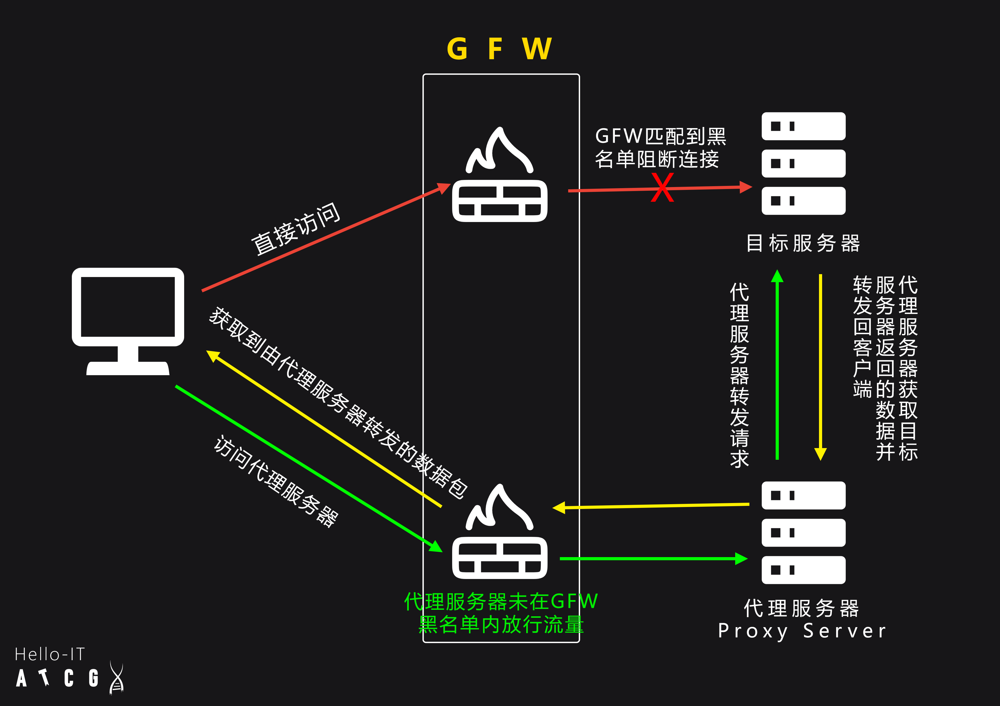
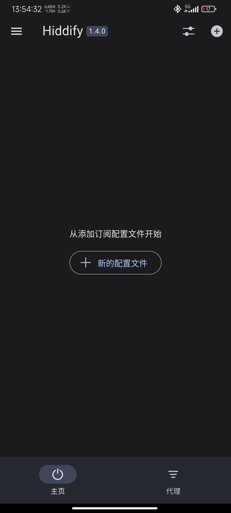
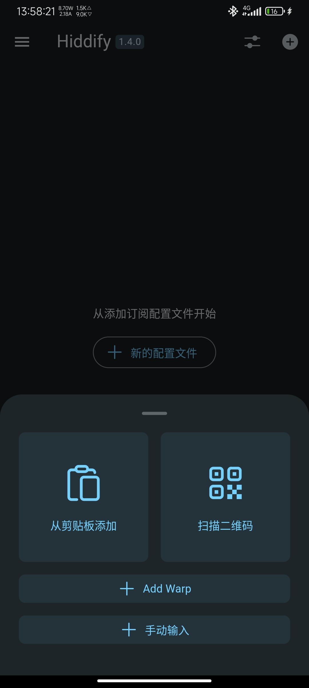
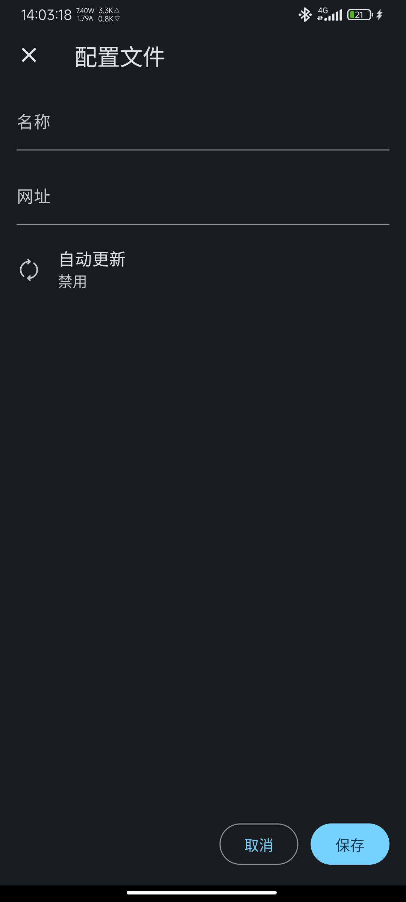
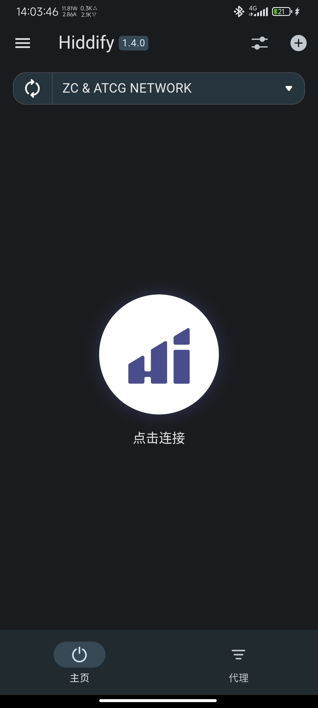
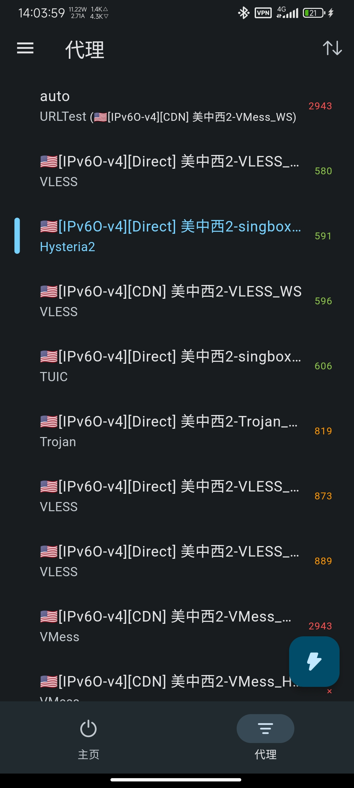
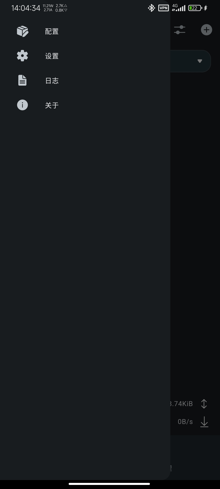
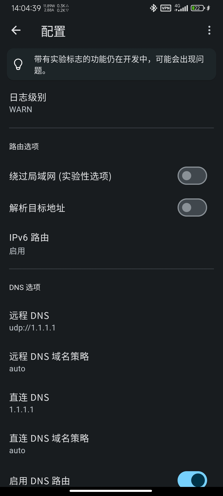
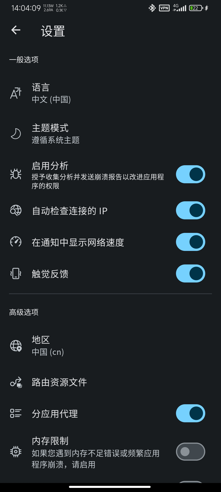

!!! Warning "警告"
    您当前查看的是完整内容，请注意人身安全，遵守当地法律。
	该板块仅为技术探讨，不涉及政治因素，请勿直接转载到国内平台。

# 原理
绕过GFW的原理很简单，也非常粗暴，即通过未被GFW“拉清单”的服务器作为中间人（代理），代替你访问目标网站，从而达到绕过GFW审查的目的。

举个例子：

假如你是苦逼住校生，一周只能回一次，你们校门口对面有一个小卖部（目标网站），你想时不时奖励一下自己买点零食吃，但是校门保安（GFW）看到你是学生就不给你出校门，同时他也认识小卖部的人，也不给他们进来；于是你想了个办法，叫一个人（代理服务器），去小卖部买零食给你，并以家长送东西为由进校门口把零食（目标网站返回的数据）给你。保安（GFW）看了一下那个人（代理服务器）发现不是黑名单里的人（服务器），便不管你们了，于是你顺利买到了你想要的零食（访问到目标网站）。

但是GFW也不是傻的，实际上GFW依旧会对代理返回的数据包进行检测，这个时候如果没有对数据进行 **加密** 就会露馅，就如同学校保安看你们天天在这送来送去，于是打开包一看好家伙全是零食，直接暴死。

于是就出现了各种传输协议，并对数据包进行加密，让GFW无法分析数据包内的内容,如Shadowsocks、ShadowsocksR、VMess、VLESS、Trojan、hysteria2....

但加密数据不代表就万事大吉了，GFW依旧能通过学习，发现各个协议的 **数据特征** 来判断是否为异常流量，虽然GFW仍然无法解密数据。同时GFW还可以通过利用各个协议的设计缺陷对潜在可疑（如某小网站短时间大流量）的代理服务器进行主动探测，判断其是否为代理服务器。

目前Shadowsocks、ShadowsocksR均已被GFW准确识别:[使用主动探测方法识别 Shadowsocks 服务 - Phuker's Blog](https://phuker.github.io/posts/shadowsocks-active-probing.html)，VMess有被识别的风险[vmess协议设计和实现缺陷可导致服务器遭到主动探测特征识别(附PoC) · Issue #2523 · v2ray/v2ray-core (github.com)](https://github.com/v2ray/v2ray-core/issues/2523)。

# 概念勘误:VPN到底是什么？
在讲如何翻墙之前，请容许咱讲讲国内翻墙人常说的VPN到底是什么，这是很多人搞错的地方。

 **虚拟专用网** **V**irtual **P**rivate **N**etwork 简称 VPN ，由名字可以看出这是拿来组建虚拟局域网的，其主要作用是方便 授权人员在外网仍然能访问内部专用网络，而无需将相关服务暴露到公网，提升了其安全性。 
### VPN最常见的用途包括：
- **远程办公**：员工可以通过VPN连接到公司内部网络，访问内部资源，如文件服务器、内部网站等。
- **安全浏览**：VPN加密用户的网络流量，防止数据在公共网络中被窃取。
- **区域限制**：在某些国家和地区，用户可以通过VPN访问被地理位置限制的网站和服务。
### VPN与翻墙:
 而用VPN来翻墙只不过是其中骚操作而已，通过组建跨国局域网，来达到使设备连接到国际网络，绕过GFW。

对于Android系统咱们发现每次打开代理软件，都会显示VPN图标，实际上Android上的系统代理并不如VPN连接好用，部分应用可能不会走系统代理，而使用VPN连接则会让所有应用流量能被代理，同时该VPN连接的服务器地址依旧指向本地代理软件（127.0.0.1）。相反，Windows用户更倾向于使用系统代理和Tun模式，因为这些方式比VPN连接更高效。在Windows中，系统代理可以灵活配置，适应不同的网络环境和需求，而Tun模式则可以更直接地处理流量，减少延迟和提高稳定性。
# 如何翻墙
好终于来到了主题！接下来咱们详细讲讲如何使用代理软件翻墙。
## 代理软件介绍
目前主要的代理软件有三类
- V2ray 使用V2ray或Xray内核，主要客户端有V2rayN、V2rayNG
- Clash 使用Clash或mihomo内核，主要客户端有Clash.Mate、Clash Verge
- Sing-box 使用Sing-box内核，主要客户端有Hiddify

Android首选Hiddify和Clash.Mate
Windows首选V2rayN和Clash Verge
Linux首选Clash Verge

## 节点类型选择
优先选择Hysteria2协议其次是Tuic，再到套CDN节点
Hysteria2由于采用极其暴力激进的发包方式使得Hysteria2节点在速度方面表现比起其它协议好。

下面是同服务器不同协议下的速度表现

## Windows下使用V2rayN
[V2rayN](https://github.com/2dust/v2rayN)是由[2dust](https://github.com/2dust/v2rayN/commits?author=2dust "View all commits by 2dust")维护的 [Xray core](https://github.com/XTLS/Xray-core) 、 [v2fly core](https://github.com/v2fly/v2ray-core) 和 [others core](https://github.com/2dust/v2rayN/wiki/List-of-supported-cores)的第三方Windows GUI发行版。

来到项目地址，这边直接无脑点Releases下载最新发行版  

  
选择v2rayN-With-Core.zip  

下载后解压到任意文件夹如D盘根目录，运行v2rayN.exe  
第一运行可能会要求你下载- [Microsoft .NET 6.0 Desktop Runtime](https://download.visualstudio.microsoft.com/download/pr/513d13b7-b456-45af-828b-b7b7981ff462/edf44a743b78f8b54a2cec97ce888346/windowsdesktop-runtime-6.0.15-win-x64.exe)运行环境，按照提示下载即可  

诺运行成功则可以看到系统托盘上出现V2rayN的图标  

打开后我们发现并没有服务器，我们需要自行添加代理服务器  

这里分享几个可以白嫖节点的仓库（还是建议去买节点体验会好很多）:  
[aiboboxx/v2rayfree: v2ray节点、免费节点、免费v2ray节点、最新公益免费v2ray节点订阅地址、免费v2ray节点每日更新、免费ss/v2ray/trojan节点、freefq (github.com)](https://github.com/aiboboxx/v2rayfree)

[freefq/free: 翻墙、免费翻墙、免费科学上网、免费节点、免费梯子、免费ss/v2ray/trojan节点、蓝灯、谷歌商店、翻墙梯子 (github.com)](https://github.com/freefq/free)

复制仓库中的节点链接到V2rayN就能成功导入服务器了  

如果不想每次都去仓库更新节点可以使用其订阅链接  

  

  
这样就不用每次都手动去仓库更新了

拿到节点后我们需要对其测试 Ctrl + A 键全选所有节点 再 Ctrl + E 多线程测试所有节点  

!!! Info "注意"
	测速为-1不一定是不能用，有些节点并不允许测试  

!!! Info "注意" 
	免费的节点速度基本堪忧（毕竟是免费的）  

选择一个合适的节点（Enter）  
然后选择自动配置系统代理  

大功告成，现在可以尝试访问Google啦。

关于路由的选择可以按照自己需要进行选择。

需要注意的是，并不是所有的WIndows应用都会走代理，如果想要所有应用都走代理就要使用TUN模式。

!!! Warning "警告"
    如果您没有对V2rayN设置开机自启，那么在关机或退出之前请务必先将 **系统代理** 设置成 **清除系统代理** 否则会出现无法上网的情况

## Android下使用Hiddify
### 基础安装&使用
访问[Hiddify](https://github.com/hiddify/hiddify-next)Github仓库（注意使用edge、chrome、firefox等非国产浏览器）
下拉找到Releases下载最新发行版

下载最新版本，安装过程咱不再多说。

打开Hiddify，点击 **新的配置文件** 

选择 **手动输入** 

名称随便，网址填从机场获取的 **V2ray格式** 的订阅地址，自动更新按个人喜好可开可关

保持后回到主界面点击 **点击连接** 开始连接

连接成功后会显示连接的节点、服务器IP、当前代理的流量和连接速度

点击下方的 **代理** 可以选择要连接的节点，默认为自动选择延迟最低的节点，也可以根据自己需要选择合适的节点。

此时就可以访问Google等受限网站了

### 必看:进阶设置&使用\
默认设置并不是最好，咱们需要根据需求做一些简单的设置

点击左上角打开 **侧边栏** ，咱们先讲讲 **配置** 

配置里有两个需要修改的地方。
 - 将 **IPv6路由** 改为启用，这样可以使用一些单栈IPv6（纯IPv6）节点。
 - 打开 **绕过局域网** 这样可以访问到同一网络下的设备，而不用来回开关带代理。

接着是 **设置** 界面强烈 **开启分应用代理** ，只代理需要代理的软件（如浏览器、X、Telegram、YouTube....），这样国内软件的流量就不会被代理，避免影响国内软件的使用（该设置对需要整天挂代理的用户非常有用）

  