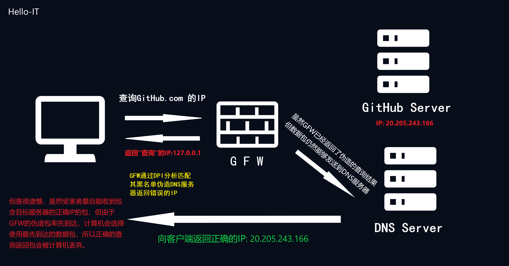
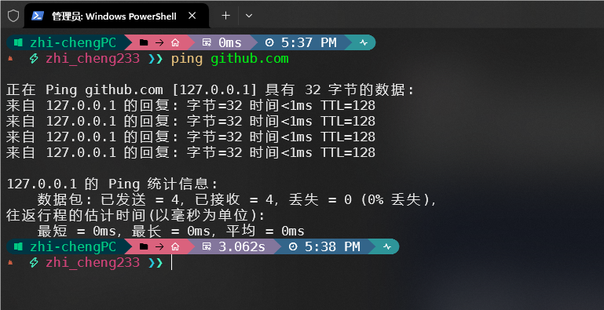

!!! Warning "警告"
    您当前查看的是完整内容，请注意人身安全，遵守当地法律。
	该板块仅为技术探讨，不涉及政治因素，请勿直接转载到国内平台。

# 什么是GFW

## 序
罗伯特·卡恩永远都不会想到自己为互联网而发明的协议，有一天会被用于网络审查的.....

## 何为GFW
GFW全称为 **Great Firewall** 即 **防火长城** 或 **中国国家防火墙** ，中国网信办称其为 **数据跨境安全网关** ，在大陆被部分网民戏称为 **墙**  。
GFW是中国政府过滤国际互联网出口内容的软硬件系统集合。其监控所有经过国际网关的通讯，对认为不符合中国官方要求的传输内容，进行干扰、阻断、屏蔽。

!!! Info "提示"
	与大部分看法不同，GFW并不是一个单独的设备，相反GFW是由众多分散的服务器与网站组成

“被墙”即指网站内容被GFW所屏蔽。“翻墙”、“挂梯子”、“科学上网”则为突破GFW限制访问受限网站。“梯子”、“VPN”、“代理”、“节点”则为突破GFW限制的工具通称。

## GFW手段
#### 深度包检测
深度包检测（Deep Packet Inspection，DPI）是一种网络流量分析技术，可以对受害者的网络数据包进行检查并进行分析、管理。深度包检测除了可以查看数据包的基础头部信息如源地址、目的地址、端口号等数据外，还可以查看分析数据包的实际内容，从而对大部分流量精选监控管理。

如GFW可以通过分析数据包中的 **目的地址** 并与其 **黑名单** 进行对比（如www.google.com）从而实现最基本的异常流量分析。

具体请看[维基百科](https://zh.wikipedia.org/wiki/%E9%98%B2%E7%81%AB%E9%95%BF%E5%9F%8E#%E6%B7%B1%E5%BA%A6%E5%8C%85%E6%A3%80%E6%B5%8B)。

#### DNS污染
如果GFW深度包检测发现其包的域名处于GFW的黑名单中，则会向受害者注入虚假（错误）的DNS查询结果，比正确的DNS解析结果更快一步到达受害者，由于DNS查询使用的是UDP协议且不对数据包进行校验，且计算机会使用最先到达的数据包，丢弃掉后面到达的数据包，从而让受害者无法访问目标网站。最著名的例子便是Github被间断性DNS污染返回127.0.0.1。

#### TCP重置攻击
利用TCP连接重置（Reset，RST）特性，GFW会向受害者发送伪造的连接重置包，使得受害者与服务器断开连接。

#### IP封锁
封锁特定IP或IP段，GFW将需要其IP地址配置为空路由、黑洞设备或特别配置的自治系统上，使得受害者无法连接到目标服务器。

#### 主动探测
GFW可以通过 **协议设计缺陷** 来 **主动探测** 服务器是否为 **代理服务器** 从而对其服务器进行 **IP封锁** 。从而达到对翻墙软件的反制。

!!! info "扩展"
	具体例子可以查看:
	- [使用主动探测方法识别 Shadowsocks 服务 - Phuker's Blog](https://phuker.github.io/posts/shadowsocks-active-probing.html)
	- [vmess协议设计和实现缺陷可导致服务器遭到主动探测特征识别(附PoC) · Issue #2523 · v2ray/v2ray-core (github.com)](https://github.com/v2ray/v2ray-core/issues/2523)

#### 大炮

!!! info "注意"
	事实上大炮（Great Cannon）与GFW是两个东西，不过鉴于都是用于网络审查且与GFW搭配使用故拿出来在这里讲。

 **大炮 （Great Cannon）** 是中国政府的 **网络攻击工具** 的名称，通过劫持大量的流量，对特定网站发动大规模的 **分布式拒绝服务攻击（DDoS）** 攻击。
 
 **大炮 （Great Cannon）** 通过向 **百度** 注入恶意的 **JavaScript代码**  ，使其受害者每隔一段时间加载一次被攻击网站，使其从中国大陆以外访问百度和广告的流量转换成DDoS攻击流量，对目标网站进行攻击，百度否认自身产品存在安全问题。

## 相关人物

#### [方滨兴](https://zh.wikipedia.org/wiki/%E6%96%B9%E6%BB%A8%E5%85%B4)
中国工程院院士、北京邮电大学前校长 **方滨兴** 是GFW的首要设计师，被誉为中国国家防火墙之父。

互联网上对此人的评价褒贬不一，同时2016年4月3日 **方滨兴** 在其母校哈尔滨工业大学进行演讲时为了论证其观点当众翻墙绕过GFW继续演讲，该事件成为了一大笑点。

2016年方滨兴在中国超算中心发表演说可以看出其观念的转变，他认为GFW如今的现状是防火墙管理人员不作为所导致的。他在演说中多次称赞美国科技公司如Google，开发出令他欣赏的筛选算法，同时鼓励中国研究员参考学习，莫不思进取。

> 你看谷歌，你看Youtube和刚才我演示的一些网页，都会有审查的制度，他们每天都过滤掉了大量的搜索结果。所以我觉得这件事防火长城应该有一个好的技术去解决。我想放行你们学生（上推特、脸谱），其实很简单，现在都可以，但是没有就说明是我们的技术不作为。

#### [思科系统](https://zh.wikipedia.org/wiki/%E6%80%9D%E7%A7%91%E7%B3%BB%E7%BB%9F "思科系统")
通信设备供应商向中华人民共和国政府提供了具有流量监控和过滤功能的互联网设备。
#### [奇虎360](https://zh.wikipedia.org/wiki/%E5%A5%87%E8%99%8E360 "奇虎360")
加入中国GFW防火长城计划
#### 启明星辰
直接负责中国政府防火长城项目

## GFW下的思考
GFW真的是中国大陆特供嘛？其实不然，俄罗斯、伊朗、叙利亚等国家也有类似于中国GFW的防火墙，就算是美国也会对部分极其敏感的议题进行小规模审查，各国其区别便在于审查范围与力度。

下面为全球 **各地区** 互联网审查状况 2018 源自[维基百科]([互联网审查 - 维基百科，自由的百科全书 (wikipedia.org)](https://zh.wikipedia.org/wiki/%E4%BA%92%E8%81%94%E7%BD%91%E5%AE%A1%E6%9F%A5#%E4%B8%96%E7%95%8C%E5%90%84%E5%9C%B0%E7%9A%84%E4%BA%92%E8%81%94%E7%BD%91%E5%AE%A1%E6%9F%A5))

GFW在某种意义上确实是中国快速发展的保障之一，GFW最大的受益者是其政府和互联网公司，也正是因为GFW的庇护国内互联网公司如百度、腾讯等才能免受国际互联网公司的冲击。可以说没有GFW就没有如今的中国互联网。

但是GFW下的中国互联网是病态的畸形的。国内互联网公司可以无需担心受到国际大公司的冲击，凭借着独特的地位与信息茧房，国内互联网公司可以无下限地作死。同时政府也由于其是国内公司方便使其配合进行网络审查（如微信取证工具，以及其政府冷备份）。

GFW的存在使得国内网民的信息差越发巨大，许多人以此商机进行割韭菜（如各大ChatGPT国内镜像）；对舆论观点的高强度审查使得网民情绪极端化，中国互联网进入站队对骂时代（粉红、支黑、反贼）。

国内的高强度审查，使得互联网的匿名性消失殆尽，实名上网的实行使得 **开盒** 相关的黑产更为暴利；政府官员开始不作为（经典的解决发现问题的人）。

方滨兴有一点说得很对，由于GFW的存在，防火墙管理人员开始变得不作为，这也间接导致了其网络审查的滥用，对其的滥用何尝不是一种不作为？

咱希望各位能够辩证的去看待一切事物，不要被情绪带偏，咱秉承一个观点：如果你带着情绪翻墙，那么咱干脆不如不教你翻墙。无可否认中国仍然需要GFW，但并不是如今一刀切的GFW，而是像 方滨兴 所说的那样 用更好的技术去解决。

## GFW的未来
无可否认GFW终有一天会倒塌，近年随着IPv6的普及GFW“漏风”的现象不时发生，GFW面对海量的IPv6地址似乎已经有点吃力了？

近年国产操作系统的兴起（如：面向移动设备的 **Harmony NEXT** 面向PC设备的 **统信UOS** 、 **deepin** ）和针对安卓、路由器的反诈APP还有应用备案政策，无不在暗示着白名单时代的到来，网络审查的地方从GFW转到的各个设备、应用的底层当中。GFW倒塌的那天，意味着新墙的建立；一个更高更大，更加坚固的墙正在建立。